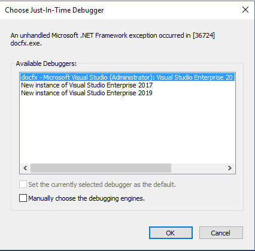

# Local Debug Docfx Demo

## Preparation

Clone docfx repo and test repo

```bash
git clone https://github.com/dotnet/docfx.git

git clone https://github.com/v-caxian/ops-knowledge-v2.git

cd docfx
git checkout dev

cd ..
cd ops-knowledge-v2
git checkout dev
```


## Step 1

Enable a break point at `& "$buildCorePowershellDestination" "$parameters"` in [~/.openpublishing.build.ps1#L18](https://dev.azure.com/ceapex/Engineering/_git/OpenPublishing.Build?path=%2FLibraries%2FMsBuildDebuggerProject%2F.openpublishing.build.ps1&version=GBdevelop&line=18&lineEnd=18&lineStartColumn=1&lineEndColumn=58&lineStyle=plain)


## Step 2

Run powershell PowerShell: `.\.openpublishing.build.ps1 -parameters:'buildConfigFile={download_config_file_path}'`

[Download Build Config](https://dev.azure.com/ceapex/Engineering/_git/OpenPublishing.Build?path=%2FDocs%2FLocal-Build.md&_a=preview)


## Step 3

Enable line breakpoint at `if (!$restoreSucceeded)` in [~/.openpublishing.buildcore.ps1#L1341](https://dev.azure.com/ceapex/Engineering/_git/OpenPublishing.Build?path=%2FLibraries%2FMsBuildDebuggerProject%2F.openpublishing.buildcore.ps1&version=GBdevelop&line=1341&lineEnd=1341&lineStartColumn=1&lineEndColumn=28&lineStyle=plain)


## Step 4

Enable line breakpoint at `& "$docfxExe" $allArgs` in [~/.optemp/packages/opbuild.scripts.{version}/tools/opbuild/docs.ps1#L502](https://dev.azure.com/ceapex/Engineering/_git/OpenPublishing.Build?path=%2FLibraries%2FMsBuildDebuggerProject%2Fopbuild%2Fdocs.ps1&version=GBdevelop&line=502&lineEnd=502&lineStartColumn=1&lineEndColumn=27&lineStyle=plain)


## Step 5

Add below code at the top of `Main()` method in [docfx/src/docfx/Program.cs](https://github.com/dotnet/docfx/blob/dev/src/docfx/Program.cs) and build the docfx project.

```cs
Console.WriteLine("Waiting for attach docfx process...");
while (!System.Diagnostics.Debugger.IsAttached)
{
    System.Threading.Thread.Sleep(1000);
}
System.Diagnostics.Debugger.Break();
```


## Step 6

Replace all docfx files in the folder `~/.optemp/packages/docfx.console.{version}/tools`.




## Step 7

[Attach](https://docs.microsoft.com/visualstudio/debugger/attach-to-running-processes-with-the-visual-studio-debugger?view=vs-2019) docfx.exe to running processes.


