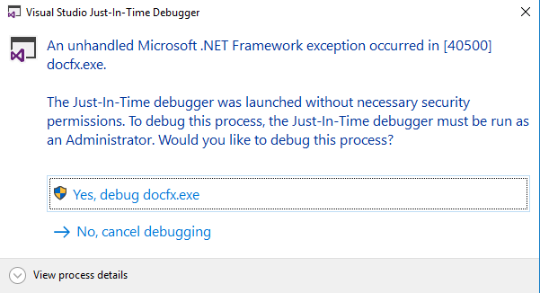

# Local Debug Docfx Demo

## Preparation

- Clone [dotnet.docfx](https://github.com/dotnet/docfx.git) and checkout `dev` branch.
- Clone [OpenPublishing.Build](https://ceapex.visualstudio.com/Engineering/_git/OpenPublishing.Build) and checkout `develop` branch.
- Clone a test repo that provisioned on v2.
- [Download Build Config](https://dev.azure.com/ceapex/Engineering/_git/OpenPublishing.Build?path=%2FDocs%2FLocal-Build.md&_a=preview)

```bash
git clone https://github.com/dotnet/docfx.git
git clone https://ceapex.visualstudio.com/Engineering/_git/OpenPublishing.Build
git clone https://github.com/v-caxian/ops-knowledge-v2.git

cd docfx
git checkout dev

cd ..
cd OpenPublishing.Build
git checkout develop

cd ..
cd ops-knowledge-v2
git checkout dev
```


## Steps

1. Run powershell script, set breakpoint before run docfx.exe

Enable a break point at `& "$buildCorePowershellDestination" "$parameters"` in [~/.openpublishing.build.ps1#L18](https://dev.azure.com/ceapex/Engineering/_git/OpenPublishing.Build?path=%2FLibraries%2FMsBuildDebuggerProject%2F.openpublishing.build.ps1&version=GBdevelop&line=18&lineEnd=18&lineStartColumn=1&lineEndColumn=58&lineStyle=plain)  


Run the powershell command `~/.openpublishing.build.ps1 -parameters:'buildConfigFile={download_config_file_path}'` to hit the breakpoint


Enable line breakpoint at `if (!$restoreSucceeded)` in [~/.openpublishing.buildcore.ps1#L1341](https://dev.azure.com/ceapex/Engineering/_git/OpenPublishing.Build?path=%2FLibraries%2FMsBuildDebuggerProject%2F.openpublishing.buildcore.ps1&version=GBdevelop&line=1341&lineEnd=1341&lineStartColumn=1&lineEndColumn=28&lineStyle=plain), then continue running the script to hit it.


Enable line breakpoint at `& "$docfxExe" $allArgs` in [~/.optemp/packages/opbuild.scripts.{version}/tools/opbuild/docs.ps1#L502](https://dev.azure.com/ceapex/Engineering/_git/OpenPublishing.Build?path=%2FLibraries%2FMsBuildDebuggerProject%2Fopbuild%2Fdocs.ps1&version=GBdevelop&line=502&lineEnd=502&lineStartColumn=1&lineEndColumn=27&lineStyle=plain), then continue running the script to hit it.


2. To debug docfx, add `System.Diagnostics.Debugger.Launch();` at the top of `Main()` method in the file [docfx/src/docfx/Program.cs](https://github.com/dotnet/docfx/blob/dev/src/docfx/Program.cs).


3. Build the docfx project and replace all published files into the folder `~/.optemp/packages/docfx.console.{version}/tools`.


4. To debug docfx plugins, like OPS Build project.

Make sure disable [Just My Code](https://docs.microsoft.com/visualstudio/debugger/just-my-code?view=vs-2019#BKMK_Enable_or_disable_Just_My_Code) 


If you took the #2, then just add `System.Diagnostics.Debugger.Break();` where you want.   


If you didn't take the #2, then add `System.Diagnostics.Debugger.Launch();` at the program entrance or the first place you want to pause.

5.  Build the ops project and replace published files into the folder `~/_themes/ContentTemplate/plugins`.


6. Continue running the script to launch and attach a debugger to the process.




