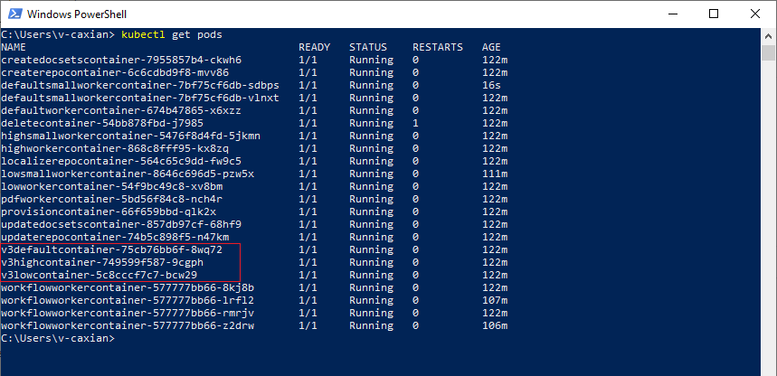

# [Bug 233392: Azure Log Alert : ops-build-service-k8s-prod - [ops-build-service-k8s-prod] [1916k8s00] LogicalDiskFreeSpace on Drive C threshold has been exceeded](https://dev.azure.com/ceapex/Engineering/_workitems/edit/233392)

## Enviroment : Internal

## Step-1: Connect to k8s

Follow this [document] (https://ceapex.visualstudio.com/Engineering/_git/Docs.Build.Infrastructure?path=%2Fdocs%2Fprepare.md&version=GBdevelop&_a=preview) connect to k8s

## Step-2: Connect to a a pod

Need to connect to a **v3** pod.



```sh
kubectl get pods
kubectl exec -it <pod_name> 
```

## Step-3: Execute powershell to check the pod status

1. Install [git](https://git-scm.com/book/en/v2/Appendix-A%3A-Git-in-Other-Environments-Git-in-PowerShell) with [git-install.ps1](https://github.com/v-caxian/ops-knowledge-v2/blob/dev/tasks/203706/git-install.ps1). If it is already installed, skip this step.

```sh
Set-ExecutionPolicy -Scope LocalMachine -ExecutionPolicy RemoteSigned -Force
Invoke-WebRequest -Uri "https://api.github.com/repos/v-caxian/ops-knowledge-v2/contents/tasks/203706/git-install.ps1?ref=dev" -OutFile "git-install.ps1"
Set-Content -Path "git-install.ps1" -Value ([System.Text.Encoding]::ASCII.GetString([Convert]::FromBase64String((Get-Content "git-install.ps1" | ConvertFrom-Json).content)))
.\git-install.ps1
```

2. Execute [git-clone.ps1](https://github.com/v-caxian/ops-knowledge-v2/blob/dev/tasks/203706/git-clone.ps1) to clone [OPS-E2E-PPE/azure-docs-pr] repo and check the free space in loop 

```sh
Invoke-WebRequest -Uri "https://api.github.com/repos/v-caxian/ops-knowledge-v2/contents/tasks/203706/git-clone.ps1?ref=dev" -OutFile "git-clone.ps1"
Set-Content -Path "git-clone.ps1" -Value ([System.Text.Encoding]::ASCII.GetString([Convert]::FromBase64String((Get-Content "git-clone.ps1" | ConvertFrom-Json).content)))
.\git-clone.ps1 -p <Your GitHub Personal Access Token>
```
